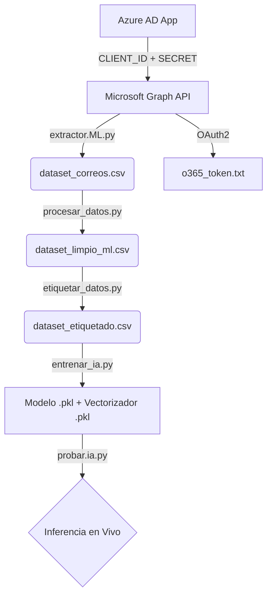

# 📧 Outlook ML Classifier (WSL: Ubuntu)

Este proyecto utiliza la **Microsoft Graph API** para extraer correos electrónicos de Outlook y aplicar modelos de **Machine Learning** para su clasificación automática. Está diseñado para ejecutarse en un entorno Linux (WSL/Ubuntu).

## 🚀 Características

- **Extracción de datos**: Conecta con Outlook vía Microsoft Graph API para obtener correos electrónicos.
- **Procesamiento de texto**: Limpieza y tokenización usando NLTK (en español).
- **Clasificación ML**: Modelo de Naive Bayes con vectorización TF-IDF.
- **Etiquetado manual**: Interfaz simple para etiquetar datos de entrenamiento.
- **Contenedorización**: Dockerfile para ejecutar en entornos aislados.
- **Autenticación OAuth2**: Uso de MSAL para autenticación segura.

---

## 📋 Prerrequisitos

- **Python 3.11+**
- **Cuenta de Microsoft/Outlook** con correos electrónicos
- **Suscripción a Azure AD** (para registrar la aplicación)
- **WSL/Ubuntu** o entorno Linux
- **Docker** (opcional, para contenedorización)

---

## ⚙️ Configuración Inicial

### 1. Clonar y configurar entorno

```bash
# Clonar el repositorio
git clone <tu-repositorio>
cd Outlook_wsl_Graph_API

# Crear entorno virtual
python -m venv .venv
source .venv/bin/activate

# Instalar dependencias
pip install -r requirements.txt
```

### 2. Configuración de Azure AD y Microsoft Graph API

Para conectar con la API de Outlook, necesitas registrar una aplicación en Azure Active Directory. Sigue estos pasos detallados:

#### Paso 1: Registrar la aplicación en Azure Portal

1. Ve a [Azure Portal](https://portal.azure.com/)
2. Navega a **Azure Active Directory** > **App registrations**
3. Haz clic en **New registration**
4. Configura:
   - **Name**: `Outlook ML Classifier` (o el nombre que prefieras)
   - **Supported account types**: `Accounts in any organizational directory and personal Microsoft accounts`
   - **Redirect URI**: Tipo `Web`, URL `http://localhost:8080` (para desarrollo local)

#### Paso 2: Obtener credenciales

Después del registro, obtén:
- **Application (client) ID**: Copia este ID (ej: `5e43e56d-280e-4bed-8643-fcce74bd4dea`)
- **Client Secret**: Ve a **Certificates & secrets** > **New client secret**
  - Description: `Secret for Outlook ML`
  - Expires: `12 months` (o según necesites)
  - Copia el **Value** del secreto (no el Secret ID)

#### Paso 3: Configurar permisos de API

1. Ve a **API permissions** en tu app registration
2. Haz clic en **Add a permission**
3. Selecciona **Microsoft Graph**
4. **Delegated permissions** (ya que actuamos en nombre del usuario):
   - `Mail.Read` - Leer correos
   - `User.Read` - Leer información básica del usuario
5. Haz clic en **Grant admin consent** si tienes permisos de admin

#### Paso 4: Configurar variables de entorno

Crea un archivo `.env` en la raíz del proyecto:

```env
CLIENT_ID=tu_application_client_id_aqui
SECRET_VALUE=tu_client_secret_value_aqui
```

**Nota**: El archivo `.env` está en `.gitignore` para proteger tus credenciales.

#### Paso 5: Autenticación inicial

La primera vez que ejecutes el script, se abrirá una ventana del navegador para autenticarte:

1. Ejecuta `python principal/extractor.ML.py`
2. Se abrirá tu navegador predeterminado
3. Inicia sesión con tu cuenta de Microsoft
4. Otorga los permisos solicitados
5. El token se guardará automáticamente en `o365_token.txt`

---

## 📊 Flujo de Trabajo (Pipeline Completo)

### Paso 1: Extracción de datos

Ejecuta el script de extracción para obtener correos de Outlook:

```bash
cd principal
python extractor.ML.py
```

Este script:
- Se conecta a Microsoft Graph API usando OAuth2
- Extrae asuntos y cuerpos de correos (configurable la cantidad)
- Guarda los datos crudos en `../data/dataset_correos.csv`

### Paso 2: Procesamiento de datos

Limpia y prepara los datos para ML:

```bash
python procesar_datos.py
```

Procesos realizados:
- Tokenización del texto usando NLTK
- Eliminación de stopwords en español
- Limpieza de URLs y caracteres especiales
- Conversión a minúsculas
- Guarda resultado en `../data/dataset_limpio_ml.csv`

### Paso 3: Etiquetado de datos

Etiqueta manualmente los correos para entrenamiento:

```bash
python etiquetar_datos.py
```

- Carga datos limpios
- Muestra cada correo para asignar categoría
- Categorías sugeridas: Trabajo, Social, Sistema, Spam, etc.
- Presiona `salir` para guardar progreso
- Resultado: `../data/dataset_etiquetado.csv`

### Paso 4: Entrenamiento del modelo

Entrena el modelo de Machine Learning:

```bash
python entrenar_ia.py
```

Proceso:
- Carga datos etiquetados
- Vectorización TF-IDF
- Entrenamiento con Naive Bayes
- Evaluación con métricas de clasificación
- Guarda modelo en `../models/modelo_correos.pkl`
- Guarda vectorizador en `../models/vectorizador.pkl`

### Paso 5: Prueba del modelo

Prueba la clasificación en tiempo real:

```bash
python probar.ia.py
```

- Ingresa texto de correo
- Obtiene predicción de categoría
- Muestra confianza del modelo

---

## 🐳 Uso con Docker

### Construir imagen

```bash
docker build -t outlook-ml-classifier .
```

### Ejecutar contenedor

```bash
# Para extracción de datos
docker run --rm -v $(pwd)/data:/app/data -v $(pwd)/o365_token.txt:/app/o365_token.txt outlook-ml-classifier

# Para procesamiento
docker run --rm -v $(pwd)/data:/app/data outlook-ml-classifier python principal/procesar_datos.py
```

**Nota**: Asegúrate de tener el token de autenticación montado si usas Docker.

---

## 📁 Estructura del Proyecto

```
Outlook_wsl_Graph_API/
├── Dockerfile                    # Configuración de contenedor
├── README.md                     # Esta documentación
├── requirements.txt              # Dependencias Python
├── .env                          # Variables de entorno (no versionado)
├── o365_token.txt               # Token de autenticación (generado)
├── data/                         # Datos del proyecto
│   ├── dataset_correos.csv       # Datos crudos extraídos
│   ├── dataset_limpio_ml.csv     # Datos procesados
│   └── dataset_etiquetado.csv    # Datos etiquetados
├── models/                       # Modelos entrenados
│   ├── modelo_correos.pkl        # Modelo de clasificación
│   └── vectorizador.pkl          # Vectorizador TF-IDF
└── principal/                    # Scripts principales
    ├── extractor.ML.py           # Extracción desde Graph API
    ├── procesar_datos.py         # Limpieza de datos
    ├── etiquetar_datos.py        # Etiquetado manual
    ├── entrenar_ia.py            # Entrenamiento ML
    └── probar.ia.py              # Pruebas del modelo
```

---

## 🔧 Tecnologías Utilizadas

- **Microsoft Graph API**: Para acceso a correos de Outlook
- **MSAL (Microsoft Authentication Library)**: Autenticación OAuth2
- **O365 Python Library**: Cliente para Graph API
- **NLTK**: Procesamiento de lenguaje natural
- **Scikit-learn**: Machine Learning (Naive Bayes, TF-IDF)
- **Pandas**: Manipulación de datos
- **Docker**: Contenedorización

---

## 🚨 Solución de Problemas

### Error de autenticación
- Verifica que el `.env` tenga las credenciales correctas
- Borra `o365_token.txt` y vuelve a autenticar
- Asegúrate de que los permisos estén otorgados en Azure

### Error de dependencias
```bash
pip install --upgrade pip
pip install -r requirements.txt --force-reinstall
```

### NLTK downloads
Si hay errores con NLTK:
```python
import nltk
nltk.download('punkt')
nltk.download('punkt_tab')
nltk.download('stopwords')
```

---

## 📈 Mejoras Futuras

- [ ] Interfaz web para etiquetado
- [ ] Más modelos de ML (SVM, Random Forest)
- [ ] Clasificación automática de nuevos correos
- [ ] Integración con reglas de Outlook
- [ ] Soporte multiidioma

---

## 📊 Flujo de Datos (Data Pipeline)



